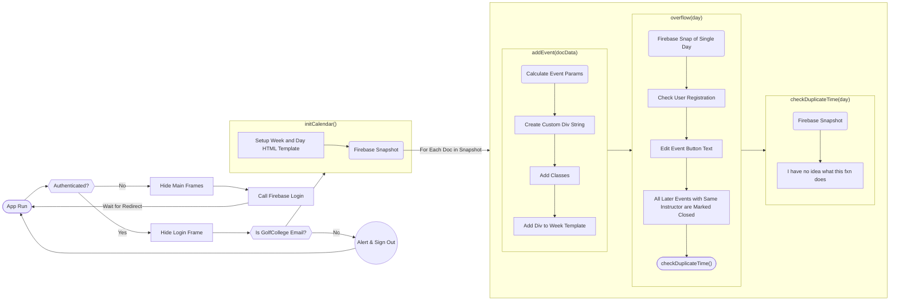

General App Structure:

```mermaid
graph LR;
    id1([App Run])
    id2{{Authenticated?}}
    id3{{Is GolfCollege Email?}}
    id4[Hide Main Frames]
    id5[Call Firebase Login]
    id6[Hide Login Frame]
    id7((Alert & Sign Out))
    id9(Firebase Snapshot)
    id10[Setup Week and Day HTML Template]
    
    id11(Calculate Event Params)
    id14[Create Custom Div String]
    id15[Add Classes]
    id16[Add Div to Week Template]
    
    id12(Firebase Snap of Single Day)
    id17[Check User Registration]
    id18[Edit Event Button Text]
    id19[All Later Events with Same Instructor are Marked Closed]
    id20(["checkDuplicateTime()"])
    
    id13(Firebase Snapshot)
    id21[I have no idea what this fxn does]    
    
    id1 --> id2
    id2 -- Yes --> id6
    id2 -- No --> id4
    id4 --> id5
    id5 -- Wait for Redirect --> id1
    id6 --> id3
    id3 -- No --> id7
    id7 --> id1
    id3 -- Yes --> init
        subgraph init["initCalendar()"]
        id10 --> id9
        end
    id9 -- For Each Doc in Snapshot --> paint 
    subgraph paint[" "]
    direction LR
    addEvent --> overflow
    overflow --> checkDuplicateTime
        subgraph addEvent["addEvent(docData)"]
        id11 --> id14 --> id15 --> id16
        end
        subgraph overflow["overflow(day)"]
        id12 --> id17 --> id18 --> id19 --> id20
        end
        subgraph checkDuplicateTime["checkDuplicateTime(day)"]
        id13 --> id21
        end
    end
```
